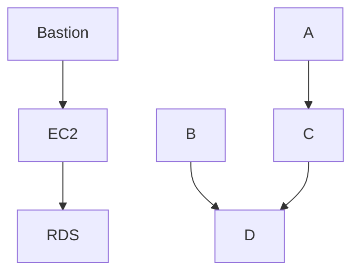

# iooding

The idea to create a skillet of my life-try like a blog, where people and I can store my ideas or things which interesting to post.


### Docs how to use:

##### Create aws user for web application to pull data from the SSM(Parameter Store)
1. [Install terraform](https://learn.hashicorp.com/tutorials/terraform/install-cli) :shipit:
2. [Install AWS CLI](https://docs.aws.amazon.com/cli/latest/userguide/getting-started-install.html)
3. [Configuration of AWS CLI](https://docs.aws.amazon.com/cli/latest/userguide/getting-started-quickstart.html) *insert your own AWS account values as described in the link.*
2. Get project from GitHub:
```
git clone https://github.com/Viktorpav/iooding.git
cd iooding/terraform
```
3. Initialization of terraform and starting iam-user module to create the user for boto3:
```
terrafrom init
terraform apply -auto-approve
```
4. Copy config file to the project:
```
cp ~/.aws/credentials <your project dir>/iooding/terraform
```
Or run the command to create a credentials file:
```bash
(echo "[default]"; echo -n "aws_access_key_id = " & terraform output -raw access_key ; echo ""; echo -n "aws_secret_access_key = " ; terraform output -raw secret_key) > ./credentials
```
5. Run a full terraform infrastructure provisioning project
```
terrafrom apply -auto-approve
```
----

<details><summary>Arhitecture overview</summary>
<p>

#### Structure of the project
For example, Mermaid can render flow charts, sequence diagrams, pie charts and more. For more information, see the Mermaid documentation (https://mermaid-js.github.io/mermaid/#/).


</p>
</details>

----

- [x] [Create user for boto3 via terraform](https://github.com/Viktorpav/iooding/commit/b05e3b96ba98f6d4403d18835934efbad1e8e520)
- [ ] Setup EC2 server with running settings.py file 
- [ ] Add delight to the experience when all tasks are complete :tada: