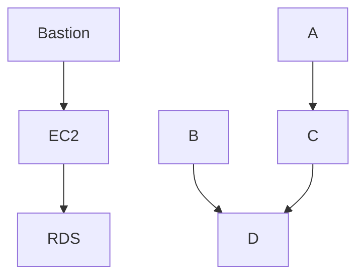

# iooding

The idea to create a skillet of my life-try like a blog, where people and I can store my ideas or things which interesting to post.


### Docs how to use:

##### Create aws user for web application to pull data from the SSM(Parameter Store)
1. [Install terraform](https://learn.hashicorp.com/tutorials/terraform/install-cli) :shipit:
2. [Install AWS CLI](https://docs.aws.amazon.com/cli/latest/userguide/getting-started-install.html)
3. [Configuration of AWS CLI](https://docs.aws.amazon.com/cli/latest/userguide/getting-started-quickstart.html) *insert your own AWS account values as described in the link.*
4. Get project from GitHub:
```
git clone https://github.com/Viktorpav/iooding.git
cd iooding/terraform
```
5. Initialization of terraform and starting iam-user module to create the user for boto3:
```
terrafrom init
terraform apply -auto-approve
```
6. Copy config file to the project:
```
cp ~/.aws/credentials <your project dir>/iooding/terraform
```
Or run the command to create a credentials file:
```bash
(echo "[default]"; echo -n "aws_access_key_id = " & terraform output -raw access_key ; echo ""; echo -n "aws_secret_access_key = " ; terraform output -raw secret_key) > ./credentials
```
7. Run a full terraform infrastructure provisioning project
```
terrafrom apply -auto-approve
```
8. Create Route53 record manualy
Add hosted zone records of NS to DNS provider(move to AWS records) or choose and create in AWS

9. Add self signed certificate on the server via openssl for Nginx
```
sudo openssl req -x509 -nodes -days 365 -newkey rsa:2048 -keyout /etc/ssl/private/nginx.key -out /etc/ssl/certs/nginx.crt
```
'Because this is self-signed, the only one that really matters is “Common Name,” which should be set to your domain name or your server’s IP address.'

On more command to generate a Diffie-Hellman group to ensure that past communications cannot be decrypted if the session key is compromised

sudo openssl dhparam -out /etc/nginx/dhparam.pem 4096

10. Create Loadbalancer
----

<details><summary>Arhitecture overview</summary>
<p>

#### Structure of the project
For example, Mermaid can render flow charts, sequence diagrams, pie charts and more. For more information, see the Mermaid documentation (https://mermaid-js.github.io/mermaid/#/).


</p>
</details>

----

- [x] [Create user for boto3 via terraform](https://github.com/Viktorpav/iooding/commit/b05e3b96ba98f6d4403d18835934efbad1e8e520)
- [x] terraform apply -exclude=module.aws_ec2_public_instance
    - Run terraform apply after extract output and one more time terraform apply
- [x] Setup EC2 server with running settings.py file 
- [ ] Work on documentation and cleaning
    - [ ] Add section for K8s section(how to provision with terraform)
    - [ ] Provide some details and usecases of section K8s (future plans)
- [ ] Implement certificate for the website
- [ ] Check if Django setup.py needs some config for SSL/TLS certificate
    https://www.howtogeek.com/devops/how-to-create-and-use-self-signed-ssl-on-nginx/
    https://www.digitalocean.com/community/tutorials/how-to-create-a-self-signed-ssl-certificate-for-nginx-on-centos-7
    https://linuxhint.com/nginx-redirect-http-https/
- [ ] Check if RDS data were integrated and create superuser 
- [ ] Add delight to the experience when all tasks are complete :tada:

——-—
- [ ] Investigate how K8s could be integrated in aws platform or how EKS works
- [ ] Check best practices with terraform or cloudformation for building microservice infra on AWS

- [ ] Dockerization of the ec2 instance (implementation in terraform or kube)
- [ ] Kubernetes integration into project

—————
- [ ] Work on search engine for research in blog
- [ ] Check if the Cloudfourmation would be more suitable for my usecase

-----
- [ ] Add sections with certificates(and post)
- [x] Describe about deploying k8s barematel possibility
