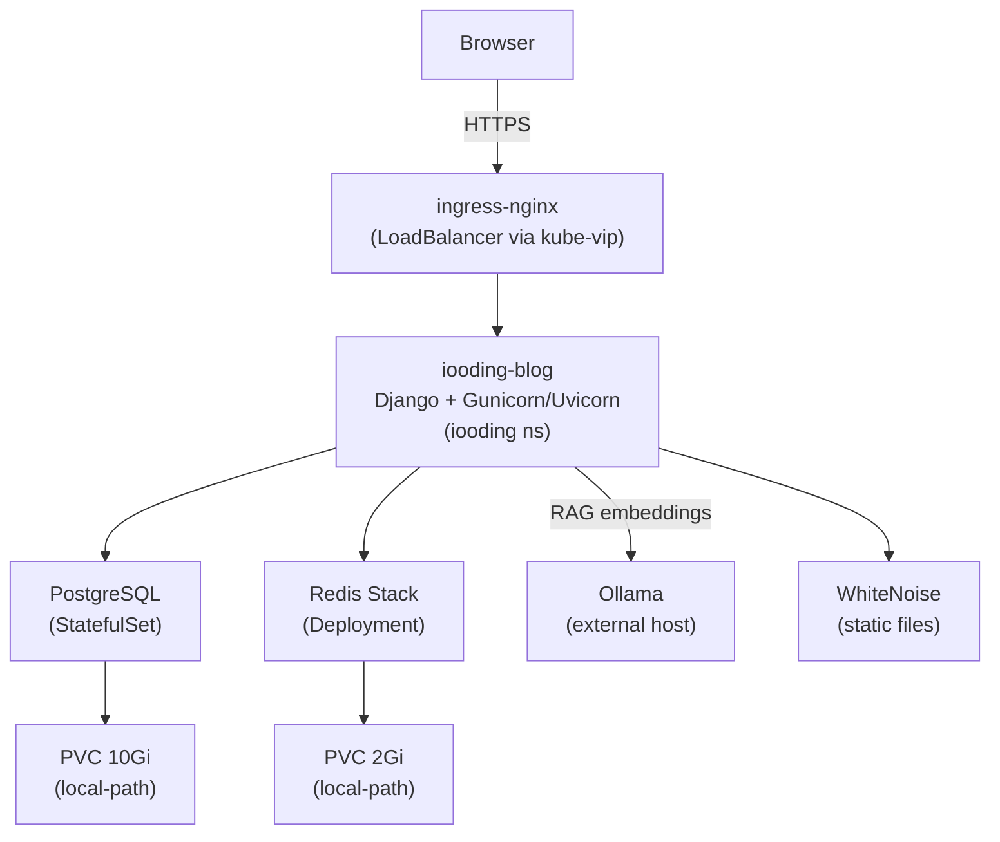

# iooding — Django Blog on Talos Kubernetes

A minimal, production-grade **Django blog** running on a personal 2-node **Talos Linux** Kubernetes cluster, managed entirely via **ArgoCD GitOps**. Features AI-assisted RAG chat powered by a local Ollama instance.

## Architecture


```mermaid
graph TD
    User["Browser"] -->|HTTPS| Ingress["ingress-nginx\n(LoadBalancer via kube-vip)"]
    Ingress --> App["iooding-blog\nDjango + Gunicorn/Uvicorn\n(iooding ns)"]
    App --> DB["PostgreSQL\n(StatefulSet)"]
    App --> Redis["Redis Stack\n(Deployment)"]
    App -->|RAG embeddings| Ollama["Ollama\n(external host)"]
    DB --> PVC_DB["PVC 10Gi\n(local-path)"]
    Redis --> PVC_Redis["PVC 2Gi\n(local-path)"]
    App --> Static["WhiteNoise\n(static files)"]
```

## Stack

| Layer | Technology |
|---|---|
| OS / K8s | Talos Linux v1.9, Kubernetes |
| GitOps | ArgoCD |
| App | Django 5.2, Gunicorn + Uvicorn (ASGI) |
| DB | PostgreSQL (psycopg2) |
| Cache / Vectors | Redis Stack |
| TLS | cert-manager (internal CA) |
| Ingress | ingress-nginx |
| LB | kube-vip (ARP mode) |
| Secrets | Sealed Secrets |
| AI | Ollama (qwen3-coder, nomic-embed-text) |

## Quick Start

### 1. Bootstrap the cluster
```bash
cd talos/
make all          # patch nodes → fetch kubeconfig → bootstrap ArgoCD → apply manifests
make hosts        # add argocd.local + iooding.local to /etc/hosts
make pass         # print ArgoCD initial admin password
```

### 2. Deploy app via ArgoCD
ArgoCD watches `k8s/manifests/` in this repo and auto-syncs. Any `git push` triggers a rolling update within ~60 s.

### 3. Check cluster health
```bash
make status       # nodes + ArgoCD apps + non-running pods at a glance
```

## Environment Variables (injected via Sealed Secret)

| Variable | Description |
|---|---|
| `DJANGO_SECRET_KEY` | Django secret key |
| `DB_PASSWORD` | PostgreSQL password |
| `REDIS_URL` | Redis connection URL |
| `OLLAMA_HOST` | Ollama API base URL |
| `CSRF_TRUSTED_ORIGINS` | Comma-separated trusted origins |
| `DJANGO_SUPERUSER_USERNAME` | Auto-created admin user |
| `DJANGO_SUPERUSER_PASSWORD` | Auto-created admin password |

## Development (local Docker)

```bash
cd iooding/
docker build -t iooding:local .
docker run -e DEBUG=True -e DB_HOST=host.docker.internal -p 8000:8000 iooding:local
```

## Key Design Decisions

- **ASGI + Uvicorn workers** — enables true async views (health check, SSE chat stream) without thread-pool blocking
- **WhiteNoise** — serves compressed static files directly from the app; no separate nginx sidecar needed
- **local-path-provisioner** instead of Longhorn — saves ~600 MiB RAM on a 2-node cluster
- **kube-vip ARP mode** — provides real LoadBalancer IPs on bare-metal without a cloud provider
- **CONN_MAX_AGE=60** — DB connection reuse reduces per-request TCP overhead
