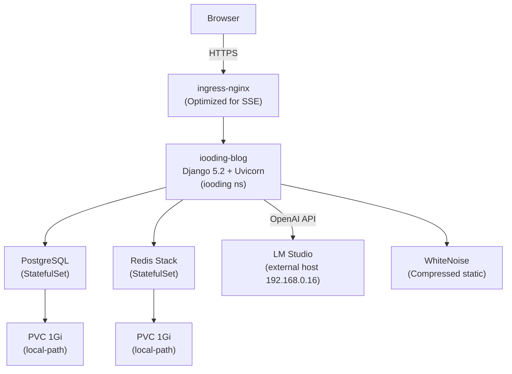

# iooding — Django Blog on Talos Kubernetes

A minimal, production-grade **Django blog** running on a personal 2-node **Talos Linux** Kubernetes cluster, managed entirely via **ArgoCD GitOps**. Features AI-assisted RAG chat powered by a local Ollama instance.

## Architecture


```mermaid
graph TD
    User["Browser"] -->|HTTPS| Ingress["ingress-nginx\n(Optimized for SSE)"]
    Ingress --> App["iooding-blog\nDjango 5.2 + Uvicorn\n(iooding ns)"]
    App --> DB["PostgreSQL\n(StatefulSet)"]
    App --> Redis["Redis Stack\n(StatefulSet)"]
    App -->|OpenAI API| LMStudio["LM Studio\n(external host 192.168.0.16)"]
    DB --> PVC_DB["PVC 1Gi\n(local-path)"]
    Redis --> PVC_Redis["PVC 1Gi\n(local-path)"]
    App --> Static["WhiteNoise\n(Compressed static)"]
```

## Stack

| Layer | Technology |
|---|---|
| OS / K8s | Talos Linux v1.9, Kubernetes |
| GitOps | ArgoCD |
| App | Django 5.2, Gunicorn + Uvicorn (ASGI) |
| DB | PostgreSQL (psycopg2) |
| Cache / Vectors | Redis Stack (Vector Search) |
| Ingress | ingress-nginx (Buffered & Gzip OFF) |
| AI | LM Studio (qwen3-coder, nomic-embed-text) |

## Quick Start

### 1. Bootstrap the cluster
```bash
cd ../          # Back to infra repo
make all        # bootstrap everything
make hosts      # add iooding.local to /etc/hosts
```

### 2. Deploy app via ArgoCD
Pushing to the `master` branch triggers the GitHub Action. The action builds the image and updates `k8s/deployment.yaml`. ArgoCD detects the change and triggers a rolling update.

## Environment Variables (injected via Sealed Secret)

| Variable | Description |
|---|---|
| `DJANGO_SECRET_KEY` | Django secret key |
| `DB_PASSWORD` | PostgreSQL password |
| `REDIS_URL` | Redis connection URL |
| `LM_STUDIO_HOST` | LM Studio API base URL (192.168.0.16:1234/v1) |
| `LM_STUDIO_API_KEY` | API Key for LM Studio |
| `CSRF_TRUSTED_ORIGINS` | Comma-separated trusted origins |

## Development (local Docker)

```bash
cd iooding/
docker build -t iooding:local .
docker run -e DEBUG=True -e DB_HOST=host.docker.internal -p 8000:8000 iooding:local
```

## Key Design Decisions

- **ASGI + Uvicorn workers** — enables true async views (health check, SSE chat stream) without thread-pool blocking
- **WhiteNoise** — serves compressed static files directly from the app; no separate nginx sidecar needed
- **local-path-provisioner** instead of Longhorn — saves ~600 MiB RAM on a 2-node cluster
- **kube-vip ARP mode** — provides real LoadBalancer IPs on bare-metal without a cloud provider
- **CONN_MAX_AGE=60** — DB connection reuse reduces per-request TCP overhead
